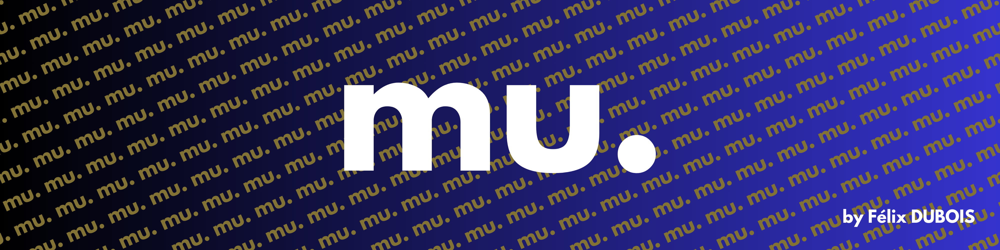

Implementation of mathematical objects in rust.

## Goal
The goal is to implement those math's object :
- [ ] Linear Algebra
  - [ ] Matrices (Working on it)
  - [ ] Vectors
  - [ ] Tensors
- [ ] Geometry
  - [ ] Points
  - [ ] Lines
  - [ ] Segments
  - [ ] Polygons
    - [ ] Triangles
    - [ ] Squares
  - [ ] Ellipses
  - [ ] Circles
  - [ ] Spheres
- [ ] Complex numbers
- [ ] Graphs
  - [ ] Graph
  - [ ] Trees
  - [ ] Nodes
  - [ ] Edges

## Why ?
It's a way for me to learn rust. I love doing math so it's kind of fun !
